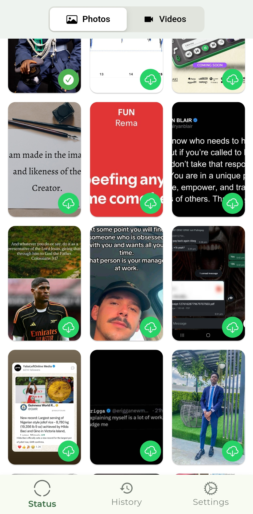
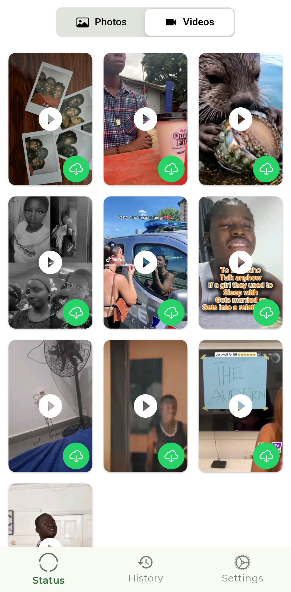
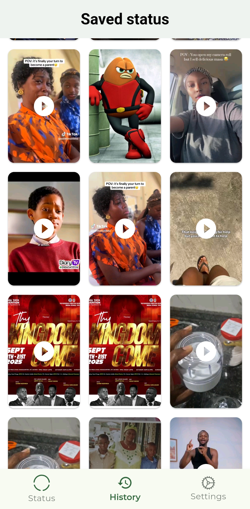
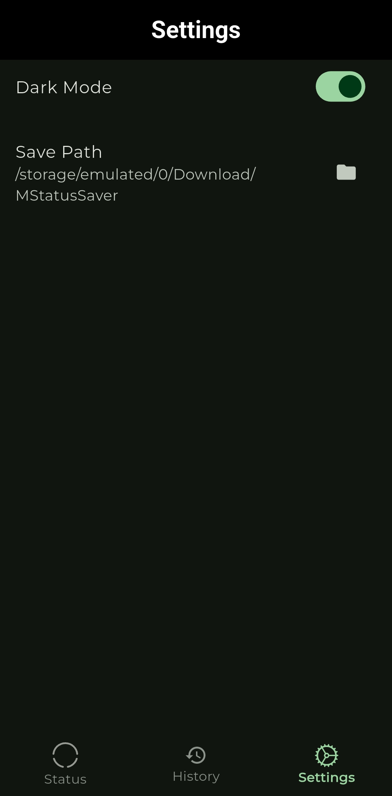

# 📱 Status Saver App

  
    

## 🚀 Overview  
An Android app built with Flutter 💙 that helps users save WhatsApp statuses offline for later viewing. Built with modern Flutter practices using Riverpod for state management, GoRouter for navigation, and a custom design system for a polished UX

---

## ✨ Features  
- 📱 **Cross-platform support** - Optimized for Android devices
- 🌙 **Light/Dark Mode** - Seamless theme switching
- 💾 **Offline Status Saving** - Save WhatsApp statuses locally
- 📱 **Responsive Design** - Adapts to different screen sizes
- ⚡ **Modern State Management** - Powered by Riverpod
- 📋 **Status History** - Keep track of saved statuses
- ⚙️ **User Settings** - Customizable app preferences

---

## 🛠️ Tech Stack  
- **Flutter** (version: 3.32.7)  
- **State Management**: [Riverpod](https://riverpod.dev/)  
- **Navigation**: [GoRouter](https://pub.dev/packages/go_router)  
- **UI Utilities**: [ScreenUtil](https://pub.dev/packages/flutter_screenutil)
- **Platform**: Android

---

## 📂 Project Structure
```plaintext
lib/
├── core/                  # App-wide utilities
│   ├── routing/           # Route definitions & navigation
│   ├── theming/           # App themes, colors, typography
│   └── utils/             # Utility classes, helpers, extensions
│
├── features/              # Feature modules
│   ├── history/           # History-related logic & UI
│   ├── settings/          # App settings & preferences
│   └── status/            # Status management feature
│
└── main.dart              # Entry point of the app
```

---

## 📋 Prerequisites
Before you begin, ensure you have the following installed:
- **Flutter SDK** (>=3.0.0) - [Installation Guide](https://docs.flutter.dev/get-started/install)
- **Dart SDK** (included with Flutter)
- **Android Studio** - For device emulation and debugging
- **Git** - For version control

---

## 🚀 Installation

#### 1. Clone the repository:
```bash
git clone https://github.com/Galadima3/status_saver.git
cd status_saver
```

#### 2. Install dependencies:
```bash
flutter pub get
```

#### 3. Run the app:
```bash
# For debug mode
flutter run

# For release mode
flutter run --release
```

#### 4. Build APK (optional):
```bash
flutter build apk --release
```

---

## 📸 Screenshots

| Home Screen A | Home Screen B | History | Settings |
|-------------|-----------|----------|---------|
|  |  |  |  |
---

## 🔧 Configuration

### Android Permissions
The app requires certain permissions to function properly. These are automatically handled in the `android/app/src/main/AndroidManifest.xml` file:

```xml
<uses-permission android:name="android.permission.READ_EXTERNAL_STORAGE" />
<uses-permission android:name="android.permission.WRITE_EXTERNAL_STORAGE" />
```

---

## 📱 Usage

1. **Launch the app** on your Android device
2. **Grant necessary permissions** when prompted
3. **Navigate to WhatsApp** and view statuses to cache them
4. **Return to Status Saver** to save desired statuses
5. **Access saved statuses** from the History tab
6. **Customize settings** from the Settings tab

---

## 🤝 Contributing

We welcome contributions from the community! Here's how you can help:

#### Steps to Contribute:
1. **Fork the repository**
2. **Create a feature branch**:
   ```bash
   git checkout -b feature/my-awesome-feature
   ```
3. **Commit your changes**:
   ```bash
   git commit -m 'Add some awesome feature'
   ```
4. **Push to your branch**:
   ```bash
   git push origin feature/my-awesome-feature
   ```
5. **Open a Pull Request**

#### Contribution Guidelines:
- Follow the existing code style and architecture
- Add tests for new features when applicable
- Update documentation as needed
- Ensure all tests pass before submitting

---

## 🐛 Issues & Support

If you encounter any issues or have questions:

1. **Check existing issues** in the [Issues tab](https://github.com/Galadima3/status_saver/issues)
2. **Create a new issue** if your problem isn't already reported
3. **Provide detailed information** including:
   - Device model and Android version
   - Flutter version
   - Steps to reproduce the issue
   - Screenshots (if applicable)

---

## 🏗️ Development

### Running Tests
```bash
flutter test
```

### Code Analysis
```bash
flutter analyze
```

### Formatting Code
```bash
flutter format .
```

---

## 📊 Project Status

- ✅ Core functionality implemented
- ✅ UI/UX design completed
- ✅ State management with Riverpod
- ⏳ Additional features in development
- 🔄 Continuous integration setup

---

## 📜 License

This project is licensed under the MIT License - see the [LICENSE](LICENSE) file for details.

---


---

## 📞 Contact

**Developer**: [Galadima3](https://github.com/Galadima3)  
**Project Link**: [https://github.com/Galadima3/status_saver](https://github.com/Galadima3/status_saver)

---

<div align="center">
  <sub>Built with ❤️ using Flutter</sub>
</div>